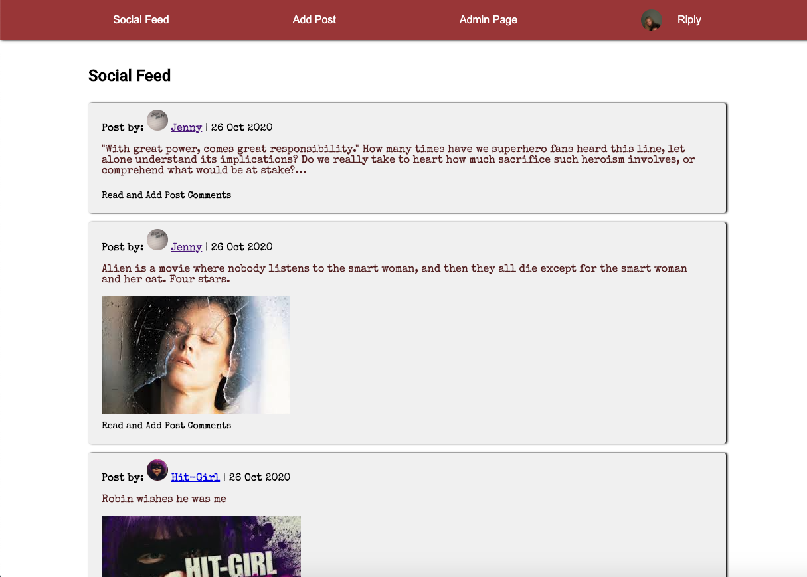
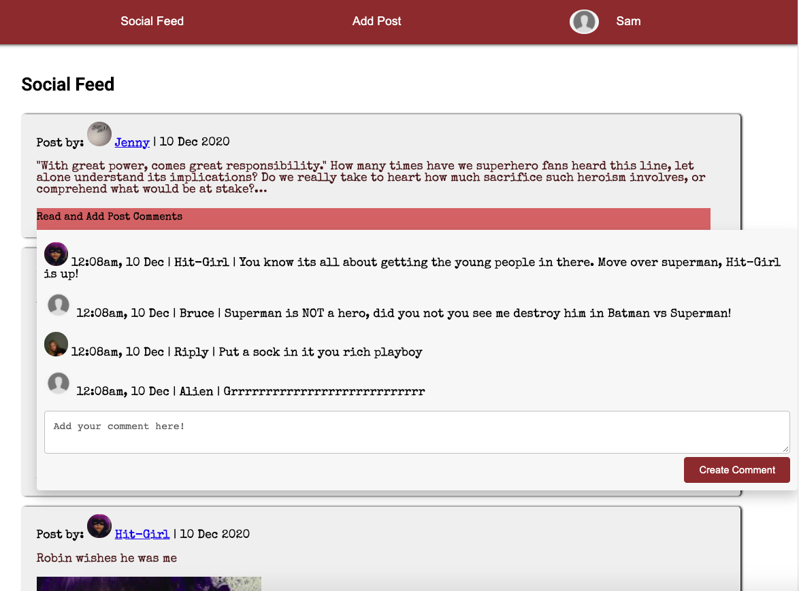
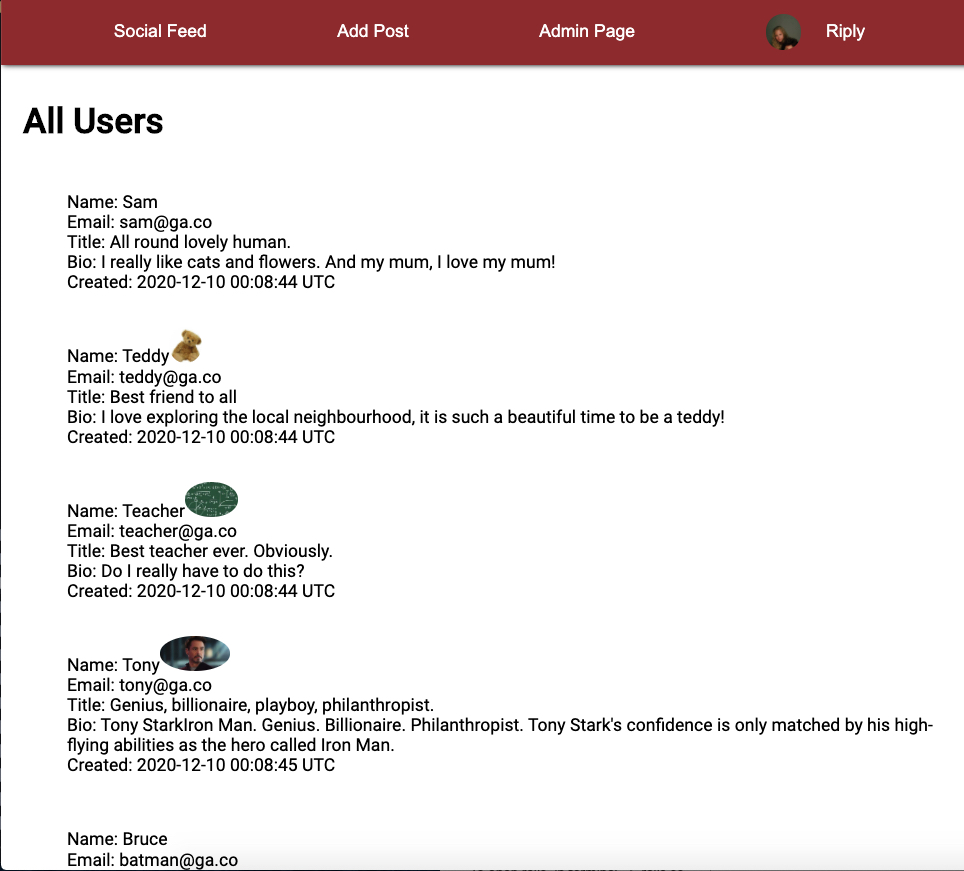
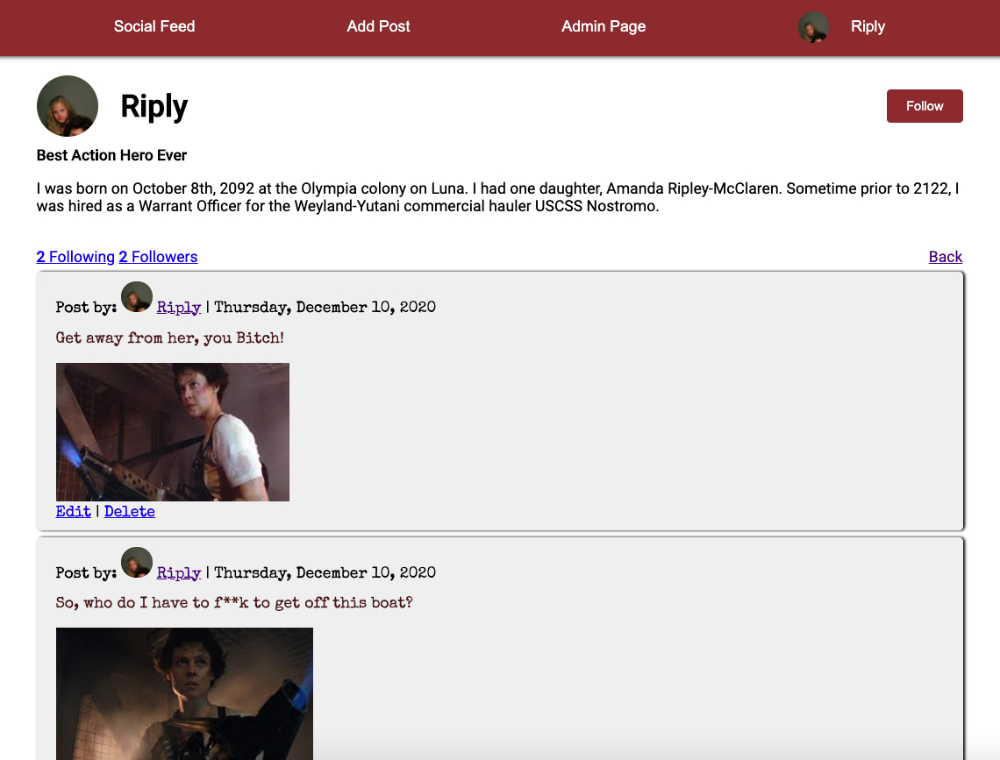

# Twitter Clone

Social networking application, allowing users to chat to each other, post pictures and follow people. Application allows users to edit, delete and update posts and accounts.
Administration has access to edit, delete all users on the site or their comments/posts.

## Project Specification's
Class project to create an application with
* Minimum three models.
* Handling of invalid data.
* Use of Gems that talks to API to add functionality
* User login and authentication
* Heroku deployment

## Build
[Link to live project on Heroku](https://immense-brushlands-44037.herokuapp.com/)

#### Comment Dropdown

#### Administration Page

#### Profile page

## Trello - User Stories with Associated Technical Tasks
[Trello Link with associated **To Do, Doing, Done** list and associated technical tasks](https://trello.com/b/dXFoKPrs/twitter-clone)

### Key Stories
* User creates account
* User can follow or be followed
* User can post content
* User can comment on other peoples posts

### Future Stories
* User can search news sources through account
* User can like posts, comments
* User can block users seeing content/profile page

## Technology Utilised
* Ruby version 2.7.2
* Rails 5.2.4.4
* HTML
* CSS
* Cloudinary
* Heroku

## DB Migrations
* users: one to many
* tweets: one to many.
* tweets_users: one to many
* relationships: followers
* comments

## Models
* users: has_many :tweets, :comments, :relationships, :followed_users :followed, :followers :followers
* tweets: belongs_to :user, has_many :comments
* comment: belongs_to :tweet :user
* relationships: belongs_to :follower :followed, validates :follower_id :followed_id
